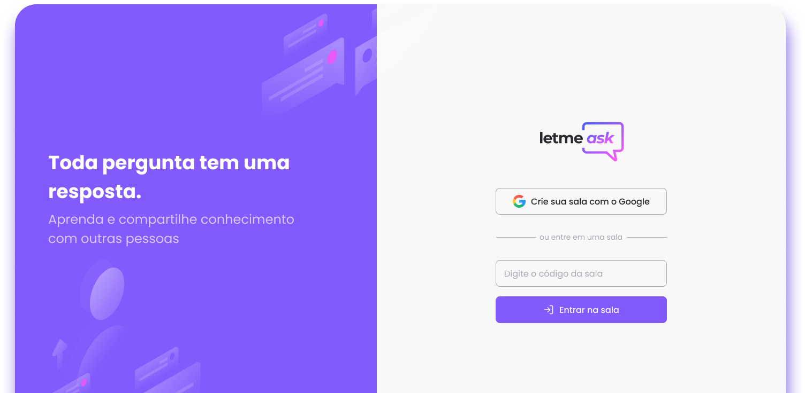

<p align="center">
  
</p>
<br>
<br>

<p align="center">
  
</p>
<br>
<br>

## O que é?
Projeto desenvolvido durante o NLW#06 no módulo especializado em REACTJS.
Neste edição do NLW se propõem a criar uma aplicação completa utilizando as tecnologias mais atuais.<br>
Algumas das tecnologias utilizadas: ReactJS, TailwindCSS e Firebase.<br>
Como parte fundamental do projeto, temos a autenticação com o GOOGLE utilziando o FIREBASE e, após logado, poderá realizar e criar salas de perguntas para que seja respondido por qualquer usuário da plataforma.<br>

### 📘 Ferramentas/Bibliotecas utilizadas
  - [ReactJS](https://nodejs.org/)
  - [Typescript](https://www.typescriptlang.org/)
  - [Firebase](https://www.npmjs.com/package/firebase)
  - [react-hot-toast](https://react-hot-toast.com/)
  - [react-router-dom](https://reactrouter.com/)
  - [Tailwindcss](https://tailwindcss.com/)
  - [ReactIcons](https://react-icons.github.io/react-icons)

### Instalação
```bash
  # Instale as dependências
  npm i
  # Atualize as variáveis de ambiente
  # Rode o projeto
  npm run dev
```

## ✔️ Autores

- [Renan Fachin](https://github.com/RenanFachin/)

## 📄 Referência

- [Rockeseat](https://www.rocketseat.com.br/)